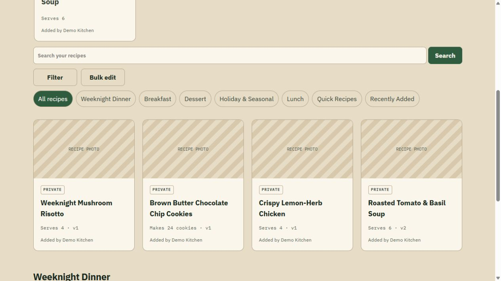
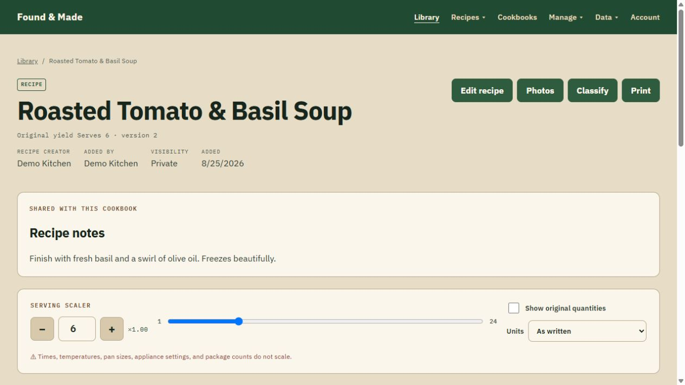
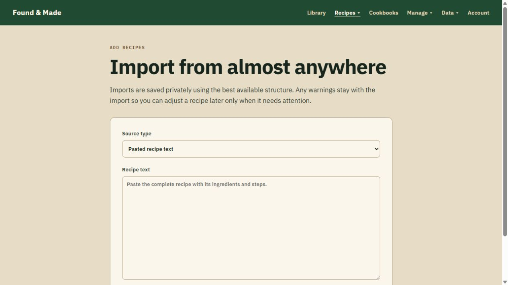
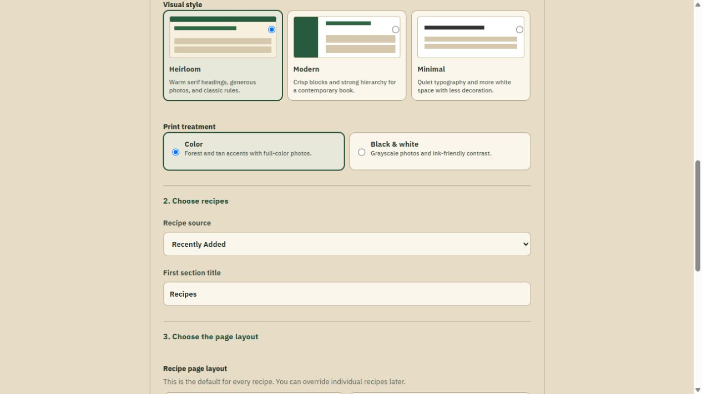

<p align="center">
  
</p>

# Found & Made

<p align="center"><strong>Recipes from anywhere, made yours.</strong></p>

<p align="center">
  <a href="https://github.com/EzekielTheMad/found-and-made/actions/workflows/ci.yml"></a>
  <a href="https://github.com/EzekielTheMad/found-and-made/releases"></a>
  <a href="https://github.com/EzekielTheMad/found-and-made/pkgs/container/found-and-made"></a>
  <a href="LICENSE"></a>
</p>

Found & Made is a self-hosted, privacy-first recipe library. Import recipes,
adapt them without losing the original context, cook from a phone or tablet,
and turn a collection into a print-ready cookbook—all while keeping the
database, media, and backups on storage you control.

> **Release status:** public beta. The core recipe, import, cooking, printing,
> backup, privacy, and multi-architecture container paths are release-gated.
> Optional Google sign-in, live Hermes interoperability, unfurl behavior, and
> physical-device/duplex-print acceptance still depend on representative
> external environments. See [What is still being verified](#what-is-still-being-verified).



## Why Found & Made

- **Own the durable copy.** SQLite, recipe media, exports, print files, keys,
  and backups all live beneath one mounted `/data` directory.
- **Private by default.** Recipes begin private. Publishing is an explicit,
  reviewed action with a deliberately smaller public projection.
- **Import without lock-in.** Start manually, paste recipe text, acquire a
  recipe website, or import supported images, PDFs, media, and recipe-manager
  exports. Every import stays editable.
- **One recipe, several useful views.** Classic, Guided, and Merge Grid views
  share exact scaling and ingredient-to-step mappings.
- **Designed for real kitchens.** Installable PWA behavior, cooking timers,
  check-offs, private notes, ratings, favorites, and offline snapshots keep the
  recipe useful at the counter.
- **Print more than a page.** Build reusable cookbooks with sections, five
  layouts, page styles, per-recipe overrides, and PDF fit checks.
- **No required cloud account.** Local Owner credentials are always the
  recovery path. Google sign-in and OpenAI-compatible import assistance are
  optional.

## See it in action

| Recipe details and exact serving scaling                                 | Private imports from multiple sources                            |
| ------------------------------------------------------------------------ | ---------------------------------------------------------------- |
|  |  |

| Cookbook style and layout builder                          |
| ---------------------------------------------------------- |
|  |

All repository screenshots use a disposable synthetic library. They contain no
household data, real email addresses, private URLs, or production identifiers.

## Install on Unraid

Once the Community Apps listing is accepted, open **Apps**, search for
**Found & Made**, and choose **Install**.

During installation:

1. Keep the default appdata path or choose another persistent share.
2. Enter **Public Origin** as the exact address you will open in a browser,
   such as `http://UNRAID-IP:3000` for LAN-only use or
   `https://recipes.example.com` behind a reverse proxy.
3. Leave **Allow insecure public origin** enabled only for intentional HTTP
   LAN use. Disable it when the public origin uses HTTPS.
4. Open the Web UI and create the first local Owner.

The complete field reference, reverse-proxy notes, upgrades, backup procedure,
and troubleshooting guide are in [docs/UNRAID.md](docs/UNRAID.md). The submitted
Community Apps template lives at
[templates/found-and-made.xml](templates/found-and-made.xml).

## Run with Docker Compose

Create a working directory, download [compose.yaml](compose.yaml), and set the
browser-facing origin before starting:

```sh
PUBLIC_ORIGIN=http://localhost:3000 docker compose up -d
```

The beta compose file follows the `beta` image tag. Pin
`FOUND_AND_MADE_TAG` to a full release tag when you want controlled upgrades.

## Run with Docker

```sh
mkdir -p ./found-and-made-data
docker run -d --name found-and-made --restart unless-stopped \
  --read-only --tmpfs /tmp:rw,nosuid,nodev,size=128m \
  -p 3000:3000 \
  -e PUID=1000 -e PGID=1000 \
  -e PUBLIC_ORIGIN=http://localhost:3000 \
  -e ALLOW_INSECURE_PUBLIC_ORIGIN=true \
  -v "$(pwd)/found-and-made-data:/data" \
  ghcr.io/ezekielthemad/found-and-made:beta
```

For a public deployment, use HTTPS, change `PUBLIC_ORIGIN` to the exact public
origin, remove the insecure override, and configure only the real reverse
proxy addresses in `TRUSTED_PROXY_RANGES`.

The container runs Node as the supplied non-root numeric `PUID:PGID`, uses
`tini` for signals, and reports database-backed readiness at
`GET /health/ready`. It supports `linux/amd64` and `linux/arm64`.

## Data, backup, and upgrades

Every durable runtime artifact is kept beneath `/data`:

```text
/data/db/                 SQLite database and migration state
/data/media/              sanitized originals and web derivatives
/data/imports/            retained import material
/data/exports/            generated portable exports
/data/print/              generated recipe and cookbook PDFs
/data/keys/               installation-owned keys
/data/backups/            checked backup generations
```

Before upgrading, create and verify a backup, retain the current image tag,
then replace the stopped container against the same `/data` mount. Migrations
are automatic and forward-only. Rolling the image back after a migration also
requires restoring the matching pre-upgrade backup. Exact commands are in
[docs/OPERATIONS.md](docs/OPERATIONS.md).

Never expose or static-mount `/data` through a web server.

## Optional integrations

- **Google sign-in:** set both `GOOGLE_CLIENT_ID` and
  `GOOGLE_CLIENT_SECRET`. Local Owner recovery remains available.
- **SMTP password recovery:** configure `SMTP_HOST`, `SMTP_FROM`, and the
  documented optional authentication settings.
- **OpenAI-compatible import structuring:** set
  `IMPORT_OPENAI_BASE_URL` and `IMPORT_OPENAI_MODEL`; an API key is optional
  for local providers that do not require one.
- **Hermes MCP:** disabled by default. When enabled, it is read-only,
  bearer-authenticated, separately scoped, and intended to remain LAN/VPN
  bound.

See [.env.example](.env.example) and [docs/OPERATIONS.md](docs/OPERATIONS.md)
for the complete server-side configuration contract.

## What is still being verified

The automated release suite covers the TypeScript application, production
build, browser journeys, trusted HTTPS proxy behavior, backup/restore, amd64,
and arm64 runtime behavior. These external checks are intentionally not
presented as complete:

- representative Google OAuth credentials and callback configuration;
- a compatible public social/unfurl target;
- a live Hermes client against an explicitly enabled deployment;
- install/sleep behavior on representative physical mobile devices;
- representative physical duplex printing.

None of those are required to run the private local recipe library. They remain
visible beta limitations so users can make an informed choice.

## Security and support

Use [GitHub Issues](https://github.com/EzekielTheMad/found-and-made/issues) for
installation help and reproducible non-sensitive bugs. Read
[SUPPORT.md](SUPPORT.md) before attaching logs.

Do not open a public issue for a suspected vulnerability. Use GitHub's private
**Report a vulnerability** flow as described in [SECURITY.md](SECURITY.md).

## Development

Found & Made is a TypeScript modular monolith built with React Router, Express,
Drizzle, and SQLite. Use Node.js 24 and npm:

```sh
npm ci
cp .env.example .env
npm run check
npm run build
npm run test:e2e:built
```

Architecture, requirements, verification evidence, and contribution guidance
are in [docs/ARCHITECTURE.md](docs/ARCHITECTURE.md),
[docs/PRD.md](docs/PRD.md), [docs/RELEASE_STATUS.md](docs/RELEASE_STATUS.md), and
[CONTRIBUTING.md](CONTRIBUTING.md).

## License

Found & Made is licensed under the
[GNU Affero General Public License v3.0](LICENSE).
